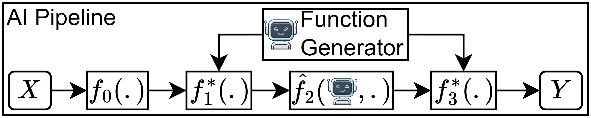
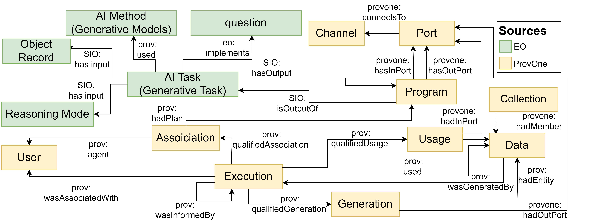
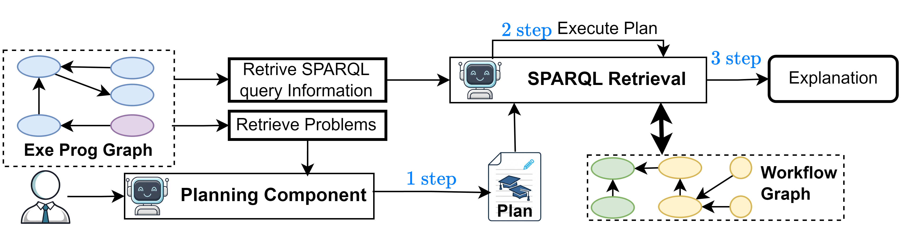

# LLM Workflow Explorer: Explainable AI through Provenance Tagging


## Abstract

As artificial intelligence systems continue to evolve into complex, multi-stage workflows orchestrating Large Language Models (LLMs) and dynamic code execution, their inherent non-determinism and opacity pose significant barriers to trust, transparency and accountability. To address this challenge, we present a novel hybrid framework for generating traceable, on-demand explanations for programmatic AI workflows. Our approach leverages the ProvONE and EO (Explanation) Ontologies to capture high-fidelity execution traces within a structured knowledge graph. Departing from traditional open-ended retrieval, we utilize the deterministic nature of the ontology to programmatically generate a comprehensive library of synthetic questions mapped to executable SPARQL queries. These queries serve as tools for an LLM-based explainer, which employs a least-to-most prompting strategy to iteratively retrieve provenance data and construct context-aware answers. We demonstrate the efficacy of our framework by implementing it within ChatBS-NexGen, a dynamic LLM unit-testing system. Our results show that this approach effectively transforms opaque execution logs into interactive, factually grounded explanations, significantly enhancing the transparency of autonomous AI processes


## Overview

The framework consists of three main components:

1. **Workflow Graph Construction**
   Execution traces are captured and serialized into a semantic workflow knowledge graph using provenance and explanation ontologies.

2. **Query Library Generation**
   A library of executable queries is automatically generated from the ontology schema, representing all retrievable information about the workflow.

3. **Explanation QA Pipeline**
   A planning agent decomposes user questions into retrieval steps, executes graph queries, and synthesizes grounded explanations.


## System Architecture

### AI Workflow Representation



### Workflow Knowledge Graph Model



### Explanation Pipeline




## Key Idea

Instead of asking an LLM to directly explain a workflow:

**We ask the LLM to plan how to retrieve evidence from a provenance knowledge graph, then generate explanations grounded in retrieved execution data.**

This transforms explanation generation from:

```
Black-box explanation → Grounded explanation from execution trace
```


