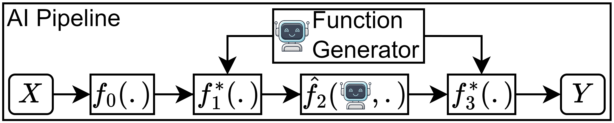
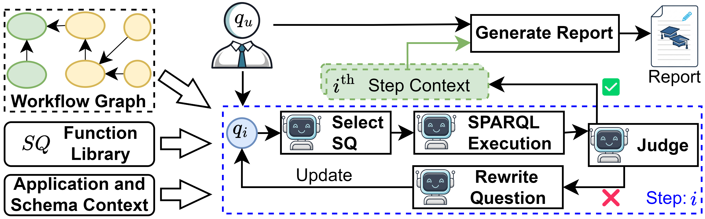

# LLM Workflow Explorer: Explainable AI through Provenance Tagging

## Abstract
```text
As artificial intelligence (AI) systems evolve into complex, multi-stage workflows orchestrating large language models (LLMs) and dynamic code execution, their inherent non-determinism and opacity pose significant barriers to trust, transparency, and accountability. Current monitoring tools are often framework-dependent and primarily focus on tracing individual agent actions rather than providing a holistic view of interactions across multiple components. To address this challenge, we present a novel hybrid framework for generating traceable, on-demand explanations for AI systems. Our approach leverages the ProvONE and Explanation Ontologies to capture execution traces as a knowledge graph, which is then used to generate natural-language explanations for user questions through a KG-based retrieval mechanism. Departing from traditional open-ended retrieval, we leverage the ontology to systematically generate a set of SPARQL queries that act as retrieval functions. Given a user question, the system iteratively selects and executes appropriate queries over the KG, using retrieved information to refine subsequent steps until a satisfactory answer is obtained. The final results are aggregated as a structured chain of evidence to produce context-aware, verifiable explanations. We evaluate the efficacy of our approach through its implementation in ChatBS-NexGen, a dynamic LLM unit-testing system, and Biomni, a general-purpose biomedical AI agent. Our results on ChatBS-NexGen and Biomni show that this approach outperforms all baselines, achieving the highest semantic and grounding metrics and over 90% win rates in pairwise explanation comparisons.
```

<p align="center">
  
</p>

## Overview

Modern AI systems often combine LLM calls, generated code, tool invocations,
intermediate artifacts, and downstream reasoning. This project records those
steps as provenance graphs and answers user questions by retrieving evidence
from the graph rather than relying only on free-form generation.

<p align="center">
  
</p>

At a high level, the pipeline:

1. Loads a workflow RDF/Turtle graph and ontology schema.
2. Explores valid ontology paths through the graph.
3. Converts useful paths into Synthetic Questions and SPARQL retrieval programs.
4. Answers benchmark questions by selecting and executing SQs.
5. Evaluates generated explanations against ground truth and baselines.

## Repository Contents

```text
.
├── src/                         # Core explorer, explainer, config, LLM, embedding, vector DB, and evaluation code
├── schema/                      # WorkFlow ontology, extracted ontology triples, and schema JSON files
├── evaluations/                 # Dataset-specific configs, ground truth, generated SQs, outputs, and analyses
│   ├── chatbs-base/
│   ├── chatbs-openai/
│   ├── biomni-base/
│   └── calibration-base/
├── usecases/                    # Source applications and sample provenance graphs
│   ├── chatbs/                  # ChatBS-NexGen submodule, configs, and sample Turtle graph
│   └── biomni/                  # Biomni submodule, configs, and sample Turtle graph
├── annotation-library/          # Python and R provenance annotation packages
│   ├── PyExplAnnotator/
│   └── RExplAnnotator/
├── baselines/                   # Baseline adapters and third-party baseline submodules
│   ├── FullContextAnswer/
│   ├── LLMbased/
│   ├── VectorSimilarityAnswer/
│   ├── HippoRAG/
│   ├── HyperGraphRAG/
│   └── grasp/
├── tests/                       # Unit and integration tests
├── paper_figures/               # Tables and figures generated for the paper
├── exeprog_creation.py          # Build executable graph exploration programs
├── progques_creation.py         # Generate Synthetic Questions from explored paths
├── explainer_experiment.py      # Run the proposed SQ-based explainer
├── baseline_*.py                # Baseline experiment entry points
├── evaluation_results.py        # Compute metric summaries
├── answer_winrate_evaluation.py # Compute pairwise answer win rates
├── run.sh                       # Example Biomni batch run
├── pyproject.toml               # Python project metadata and dependencies
└── uv.lock                      # Locked Python dependency graph
```

## Configuration

Run commands are driven by YAML files under `evaluations/<evaluation-name>/`.
The main evaluation folders are `chatbs-base`, `biomni-base`,
`chatbs-openai`, and `calibration-base`.

Important config files:

- `config.yaml`: main workflow graph, ontology, SQ generation, and explainer settings.
- `config.fullcontext.yaml`: full-context baseline settings.
- `config.llmbased.yaml`: LLM-based grounded workflow baseline settings.
- `config.vectorsimilarity.yaml`: vector similarity baseline settings.
- `config.hipporag.yaml`: HippoRAG-KG adapter settings.
- `config.hypergraphrag.yaml`: HyperGraphRAG-KG adapter settings.
- `config.evaluation.yaml`: metric, prediction directory, judge model, and win-rate settings.

The default `chatbs-base` and `biomni-base` configs use local Turtle files:

- `usecases/chatbs/data/1_sample_graph/chatbs_sample.ttl`
- `usecases/biomni/data/task3/biomni_sample.ttl`

The Python pipeline reads these files directly with `rdflib`; a separate
SPARQL server is not required for the standard runs.

## Setup

The project uses Python 3.13 and `uv`.

```bash
git clone --recurse-submodules <repo-url>
cd LLM-Workflow-Explorer
uv sync
cp .env.sample .env
```

If the repository was cloned without submodules, initialize them before running
the baseline adapters:

```bash
git submodule update --init --recursive
```

The default configs use LM Studio-compatible local endpoints:

```text
http://localhost:1234/v1
```

Start LM Studio or another OpenAI-compatible local server before running the
LLM-backed scripts, and make sure the configured chat and embedding models are
available. The checked-in configs currently reference:

- chat model: `openai/gpt-oss-20b`
- embedding model: `text-embedding-bge-large-en-v1.5`

If you switch configs to OpenAI-backed clients, set `OPENAI_API_KEY` in `.env`.
The Milvus-backed object search expects a Milvus server at `MILVUS_URI`, which
defaults to `http://localhost:19530`.

You can either prefix commands with `uv run` or activate the created virtual
environment:

```bash
source .venv/bin/activate
```

## Run Commands

Run all commands from the repository root so relative paths in the YAML configs
resolve correctly.

### Generate Executable Programs and Synthetic Questions

For ChatBS:

```bash
uv run python exeprog_creation.py --evaluation chatbs-base
uv run python progques_creation.py --evaluation chatbs-base
```

For Biomni:

```bash
uv run python exeprog_creation.py --evaluation biomni-base
uv run python progques_creation.py --evaluation biomni-base
```

Generated files are written under:

- `evaluations/<evaluation>/exeprog_creation/`
- `evaluations/<evaluation>/ques_creation/SyntheticQuestionKG.csv`

### Run the Proposed Explainer

```bash
uv run python explainer_experiment.py --evaluation chatbs-base
uv run python explainer_experiment.py --evaluation biomni-base
```

Outputs are saved to timestamped folders under:

```text
evaluations/<evaluation>/explainer/results/
```

### Run Baselines

For ChatBS:

```bash
uv run python baseline_FullContextAnswer.py --evaluation chatbs-base
uv run python baseline_LLMbased.py --evaluation chatbs-base
uv run python baseline_VectorSimilarityAnswer.py --evaluation chatbs-base
uv run python baseline_HippoRAG.py --evaluation chatbs-base
uv run python baseline_HyperGraphRAG.py --evaluation chatbs-base
```

For Biomni:

```bash
uv run python baseline_FullContextAnswer.py --evaluation biomni-base
uv run python baseline_LLMbased.py --evaluation biomni-base
uv run python baseline_VectorSimilarityAnswer.py --evaluation biomni-base
uv run python baseline_HippoRAG.py --evaluation biomni-base
uv run python baseline_HyperGraphRAG.py --evaluation biomni-base
```

The HippoRAG and HyperGraphRAG adapters include useful smoke-test flags:

```bash
uv run python baseline_HippoRAG.py --evaluation chatbs-base --limit-questions 5 --max-objects 50
uv run python baseline_HyperGraphRAG.py --evaluation chatbs-base --limit-questions 5 --max-objects 50
```

Use `--prepare-only` with either adapter to build the converted KG input files
without running the full baseline.

### Evaluate Results

Metric summaries:

```bash
uv run python evaluation_results.py --evaluation chatbs-base
uv run python evaluation_results.py --evaluation biomni-base
```

Pairwise answer win rates:

```bash
uv run python answer_winrate_evaluation.py --evaluation chatbs-base
uv run python answer_winrate_evaluation.py --evaluation biomni-base
```

Outputs are written under each evaluation folder's configured analysis path,
for example:

```text
evaluations/chatbs-base/analysis/
evaluations/biomni-base/analysis/
```

### Batch Script

`run.sh` is an example Biomni batch script. In its current form it:

1. Activates `.venv`.
2. Runs `baseline_HyperGraphRAG.py --evaluation biomni-base`.
3. Runs `evaluation_results.py --evaluation biomni-base`.
4. Runs `answer_winrate_evaluation.py --evaluation biomni-base`.

Other baseline commands are included in the script as commented examples.

```bash
bash run.sh
```

### Inspect and Export Results

Show generated Synthetic Questions with their tags:

```bash
uv run python show_question_tags.py evaluations/chatbs-base/ques_creation/SyntheticQuestionKG.csv --limit 20 --print
```

Render `RESULTS.jsonl` outputs into text files:

```bash
uv run python visualize_explainer_results.py --evaluation chatbs-base --variant results
uv run python visualize_explainer_results.py --evaluation biomni-base --variant hypergraphrag
```

## Tests

Run the unit test suite with:

```bash
uv run pytest
```

Some integration tests and full experiment runs require local services such as
LM Studio and Milvus, plus the initialized baseline submodules.

## Annotation Libraries

The repository includes reusable provenance annotation packages.

Python package:

```bash
uv run pip install -e "annotation-library/PyExplAnnotator[dev]"
```

R package:

```r
install.packages(c("jsonlite", "rdflib", "yaml", "remotes"))
remotes::install_local("annotation-library/RExplAnnotator")
```

The ChatBS use case is an R/Shiny application in
`usecases/chatbs/ChatBS-NexGen/`. The Biomni use case is included as a submodule
under `usecases/biomni/Biomni/`.

## Benchmarks and Baselines

The repository includes benchmark configs and ground-truth data for:

- ChatBS-NexGen workflow explanation.
- Biomni biomedical agent workflow explanation.
- Calibration experiments used while developing the pipeline.

Baselines include:

- FullContextAnswer
- LLMbased GroundedWorkflowBaseline
- VectorSimilarityAnswer
- HippoRAG-KG
- HyperGraphRAG-KG
- GRASP

## Citation

Publication metadata is still pending.

```bibtex
TBA
```

## License

This repository is released under the MIT License. See `LICENSE`.
